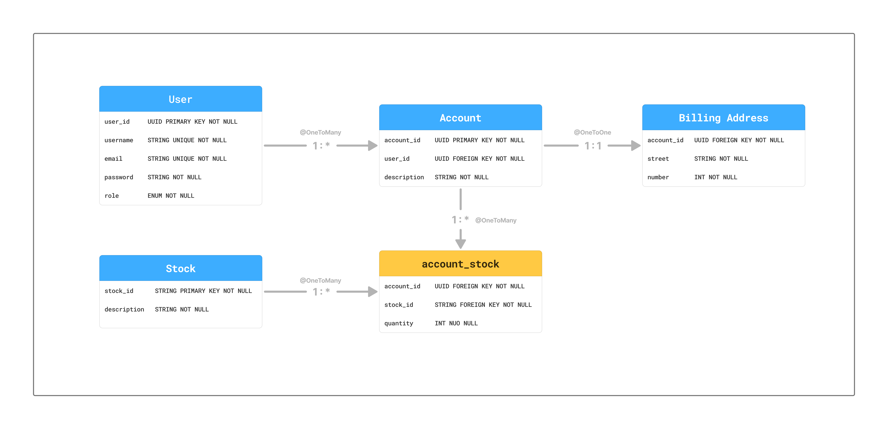

# 📈 Agregador de Investimentos API - Backend


Esta é uma API RESTful robusta desenvolvida para auxiliar investidores na gestão de seus ativos. O sistema permite a criação de contas, associação de ações e o cálculo automático do patrimônio total baseado em dados em tempo real.

---

## 🖼️ Arquitetura e Modelo de Dados

Abaixo está o diagrama que ilustra o relacionamento entre as entidades do sistema (Usuários, Contas, Ações e Endereços).



---

## 🚀 Tecnologias Utilizadas

* **Java 21** & **Spring Boot 4.0.1**: Base do ecossistema.
* **Spring Security & JWT**: Autenticação stateless e autorização baseada em Roles (ADMIN/USER).
* **Spring Data JPA**: Abstração de persistência com suporte a diversos bancos de dados.
* **OpenFeign**: Cliente HTTP declarativo para integração com a API **Brapi**.
* **Lombok**: Redução de código boilerplate.
* **Resilience4j**: Implementação de *Circuit Breaker* para garantir disponibilidade caso a API externa falhe.
* **JUnit 5 & Mockito**: Testes de unidade e mocks de serviços.

---

## 🔒 Funcionalidades de Segurança (Destaques)

### 🛡️ Hashing de Senhas
As senhas nunca são armazenadas em texto plano. Utilizamos o **BCryptPasswordEncoder** tanto na criação quanto na atualização do perfil.

### 🔑 Validação de Propriedade (Ownership Check)
Utilizamos a interface `Principal` do Spring Security para garantir que um usuário autenticado só possa:
* Visualizar suas próprias contas.
* Atualizar seus próprios dados.
* Deletar seu próprio registro (Segurança contra IDOR).

### 🚫 Global Exception Handler
Tratamento centralizado de erros que fornece respostas claras e seguras via DTOs, evitando vazamento de stacktraces do servidor.

---

## 📊 Principais Endpoints

### Autenticação
* `POST /users/login`: Autentica o usuário e retorna um Bearer Token JWT.

### Usuários
* `POST /users`: Cadastro de novos usuários (Público).
* `GET /users/all`: Listagem geral (Apenas ADMIN).
* `PUT /users/{userId}`: Atualização de perfil (Protegido/Seguro).
* `DELETE /users/{userId}`: Exclusão de conta (Protegido/Seguro).

### Investimentos & Contas
* `POST /users/{userId}/accounts`: Criação de carteira de investimentos.
* `GET /users/{userId}/accounts`: Listagem de carteiras vinculadas.
* `GET /accounts/{accountId}/balance`: **Cálculo de Patrimônio**. Realiza a soma de `Preço Atual (API Externa) * Quantidade` de cada ativo na conta.

---

## ⚙️ Configuração do Ambiente

Para rodar o projeto, você precisará configurar as seguintes variáveis no seu `application.properties` ou nas variáveis de ambiente do sistema:

```properties
# Brapi API Token (Obtenha em brapi.dev)
TOKEN=seu_token_aqui

# JWT Secret
api.security.token.secret=${JWT_SECRET:minha-chave-secreta}

# Database (H2 exemplo)
spring.datasource.url=jdbc:h2:mem:investdb
spring.h2.console.enabled=true